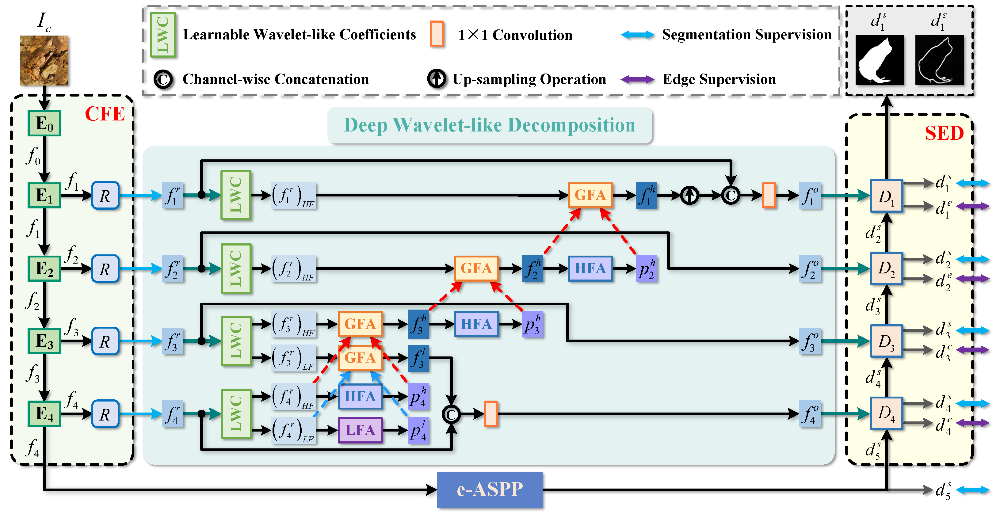

# FEDER
**Camouflaged Object Detection with Feature Decomposition and Edge Reconstruction**,  CVPR 2023

[Paper] [Supplementary material] [[Results](https://drive.google.com/drive/folders/1Pho42bHiBhVR0l9KzdOFQgqLzr8mSv9e?usp=sharing)] [[Pretrained models](https://drive.google.com/file/d/1MONpM9auqGlRoyaOKUe6wJgLZ-E6A4Dc/view?usp=sharing)]

#### Authors
[Chunming He](https://chunminghe.github.io/), [Kai Li*](http://kailigo.github.io/), [Yachao Zhang](https://yachao-zhang.github.io/), Longxiang Tang, [Yulun Zhang](https://yulunzhang.com/), [Zhenhua Guo](https://scholar.google.com/citations?user=dbR6bD0AAAAJ&hl=en), [Xiu Li*](https://scholar.google.com/citations?user=Xrh1OIUAAAAJ&hl=en)

---
> **Abstract:** *Camouflaged object detection (COD) aims to address the tough issue of identifying camouflaged objects visually blended into the surrounding backgrounds. COD is a challenging task due to the intrinsic similarity of camouflaged objects with the background, as well as their ambiguous boundaries. Existing approaches to this problem have developed various techniques to mimic the human visual system. Albeit effective in many cases, these methods still struggle when camouflaged objects are so deceptive to the vision system. In this paper, we propose the FEature Decomposition and Edge Reconstruction (FEDER) model for COD. The FEDER model addresses the intrinsic similarity of foreground and background by decomposing the features into different frequency bands using learnable wavelets. It then focuses on the most informative bands to mine subtle cues that differentiate foreground and background. To achieve this, a frequency attention module and a guidance-based feature aggregation module are developed. To combat the ambiguous boundary problem, we propose to learn an auxiliary edge reconstruction task alongside the COD task. We design an ordinary differential equation-inspired edge reconstruction module that generates exact edges. By learning the auxiliary task in conjunction with the COD task, the FEDER model can generate precise prediction maps with accurate object boundaries. Experiments show that our FEDER model significantly outperforms state-of-the-art methods with cheaper computational and memory costs.*
>
> <p align="center">
> 
> </p>
---
Code will be released.

## Related Works
[Feature Shrinkage Pyramid for Camouflaged Object Detection with Transformers](https://github.com/ZhouHuang23/FSPNet), CVPR23.

[Concealed Object Detection](https://github.com/GewelsJI/SINet-V2), TPAMI22.

You can see more related papers in [awesome-COD](https://github.com/visionxiang/awesome-camouflaged-object-detection).
## Citation
If you find our work useful in your research, please consider citing:
```
@inproceedings{He2023Camouflaged,
title={Camouflaged Object Detection with Feature Decomposition and Edge Reconstruction},
author={He, Chunming and Li, Kai and Zhang, Yachao and Tang, Longxiang and Zhang, Yulun and Guo, Zhenhua and Li, Xiu},
booktitle={IEEE Conference on Computer Vision and Pattern Recognition (CVPR)},
year={2023}
}
```
## Acknowledgement
The code is built on [SINet V2](https://github.com/GewelsJI/SINet-V2). Please also follow the corresponding licenses. Thanks for the awesome work.
